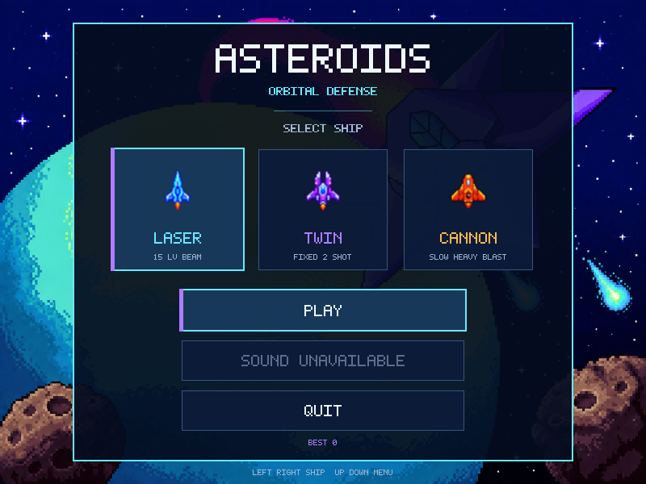
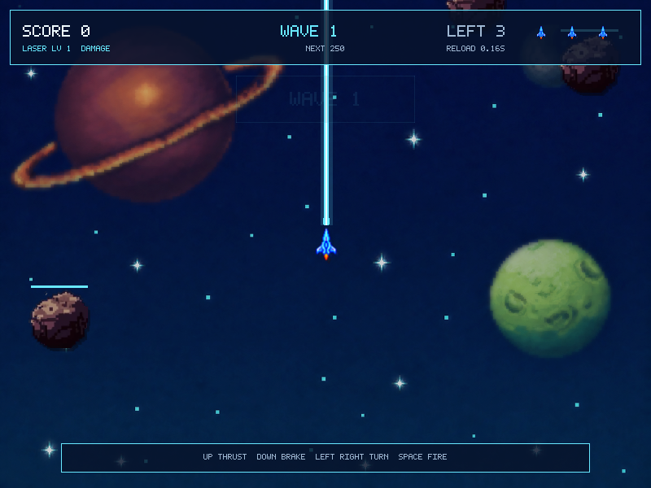

# SpaceShooter Legacy

SpaceShooter Legacy là phiên bản cải tiến từ game bắn thiên thạch C++/SDL2 gốc do **Hoàng Thái Dương** tự xây dựng. Dự án giữ lại tinh thần, lối chơi và tài nguyên pixel-art của bản đầu tiên, đồng thời tái cấu trúc toàn bộ mã nguồn để game mượt hơn, ổn định hơn và dễ tiếp tục phát triển.

Phiên bản mới bổ sung fixed timestep, nội suy chuyển động, collision chính xác, quản lý tài nguyên bằng RAII, kiến trúc state-based, UI hoàn chỉnh và hệ thống hiệu ứng hình ảnh theo thời gian thực. Các ảnh nền cũ được nâng cấp nhưng vẫn giữ bố cục và phong cách retro nguyên bản.

## Hình ảnh

| Menu | Gameplay |
| --- | --- |
|  |  |

## Điểm cải tiến nổi bật

- Gameplay chạy ở fixed timestep 60 Hz, render tối đa 120 Hz và nội suy vị trí giữa các simulation tick.
- Màn hình chọn ba lớp tàu với thiết kế, màu sắc, tốc độ và vũ khí riêng.
- Chuyển động tàu, đạn và thiên thạch mượt, không phụ thuộc FPS.
- Collision của đạn dùng swept segment, hạn chế xuyên thiên thạch khi vận tốc cao.
- Tàu, đạn, thiên thạch và particle dùng pool cố định; hot path không cấp phát heap.
- Hiệu ứng động gồm lửa động cơ, muzzle flash, glow, bóng đổ, rung màn hình, hit flash, particle burst và shockwave.
- Hệ thống wave tự tăng số lượng và tốc độ thiên thạch.
- Thiên thạch có máu, hit flash và health bar; máu tăng theo wave và thời gian sống sót.
- Vật phẩm nâng cấp xuất hiện ngẫu nhiên khi đạt mốc điểm và tăng vũ khí đến level 5.
- Menu, HUD, pause overlay và game-over flow hỗ trợ bàn phím lẫn chuột.
- Âm thanh là tùy chọn; game vẫn build và chạy khi không có SDL2_mixer.
- Có test logic, benchmark, CMake, Makefile và GitHub Actions CI.

## Kiến trúc

```text
.
├── assets/
│   ├── audio/                  # Nhạc và hiệu ứng âm thanh tùy chọn
│   └── images/                 # Texture gốc và texture đã nâng cấp
├── include/game/
│   ├── core/                   # Application, graphics, audio, assets
│   ├── entities/               # Player, Bullet và AsteroidField
│   ├── math/                   # Vector2
│   ├── states/                 # Menu, Playing và GameOver
│   └── ui/                     # Bitmap font, panel và button renderer
├── src/                        # Phần triển khai
├── tests/                      # Test logic và benchmark
├── CMakeLists.txt
└── Makefile
```

`Application` sở hữu SDL runtime, tài nguyên và state hiện tại. Mỗi state tách riêng xử lý input, update và render. Texture được tải một lần khi khởi động và có một owner duy nhất.

## Tàu và vũ khí

- **Laser:** tàu đánh chặn màu cyan, phát tia thẳng tức thời từ tàu đến rìa và không dùng pool đạn. Level 1–5 tăng sát thương, level 6–10 tăng độ rộng tia, level 11–15 tăng dần đến 5 lần phản xạ.
- **Twin:** chiến đấu cơ màu tím, luôn bắn đúng hai viên song song. Nâng cấp tăng sát thương và tầm bắn nhưng không tăng số viên.
- **Cannon:** gunship màu cam đỏ, bắn chậm nhưng đạn pháo mạnh, có lõi năng lượng và vụ nổ gây sát thương diện rộng lên các thiên thạch lân cận.

Ba tàu nạp vũ khí hoàn toàn theo thời gian: Laser `0,16 giây`, Twin `0,30 giây`, Cannon `1,32 giây`. Không có logic nạp dựa trên số đạn còn lại.

Thiên thạch lớn, vừa và nhỏ lần lượt cho `100`, `50` và `20 XP`, không còn hệ số nhân 12. Khi thiên thạch vỡ, lượng XP nhận được bật lên ngay tại vị trí nổ. Các mốc đầu là `250`, `700`, `1400`, `2400`; Laser tiếp tục có mốc nâng cấp đến level 15. Tàu phải chạm vào vật phẩm để nhận level. Đạn thường bị hủy khi chạm rìa; riêng Laser level 11–15 có phản xạ.

Độ khó được cân bằng theo cả wave lẫn thời gian sống sót: số thiên thạch, vận tốc và máu tăng dần. Thiên thạch lớn bắt đầu với nhiều máu hơn thiên thạch vừa và nhỏ.

Trận bắt đầu với 4 thiên thạch, vận tốc cơ bản 28–52 pixel/giây. Đội hình gồm đá thường, loại giáp dày (gấp đôi máu, tốc độ bằng 75%) và loại bay lượn (tốc độ bằng 140%, quỹ đạo uốn cong). Các loại giữ màu texture gốc. Mảnh vỡ kế thừa loại của thiên thạch mẹ. Hệ số tốc độ theo wave tối đa 3; mảnh vỡ tối đa 200 pixel/giây; phần máu cộng thêm theo tiến độ tối đa 12 trước khi áp dụng loại và kích thước.

## Thiên thạch và sao băng

Thiên thạch dùng texture pixel-art gốc, biến đổi tỷ lệ và đường viền theo seed riêng để tạo nhiều dáng mà vẫn giữ màu và chi tiết bề mặt. Khi nổ, các mảnh vụn dùng cùng texture, xoay, bay tỏa ra và mờ dần cùng tia lửa và sóng xung kích. Mảnh vụn hiệu ứng không gây va chạm.

Sao băng đầu tiên xuất hiện sau khoảng 10 giây; các đợt sau cách nhau ngẫu nhiên 18–30 giây. Mỗi đợt chỉ có một sao băng, bay từ trái hoặc phải với vận tốc ngang 240–300 pixel/giây, có đuôi lửa và ít nhất 18 máu. Nó không quay vòng màn hình, không sinh thiên thạch con và không chặn chuyển wave. Bắn hạ bằng bất kỳ vũ khí nào được thưởng thêm 1.500 điểm, ngoài 20 XP thông thường. Điểm bonus không dùng để nâng cấp vũ khí.

## Yêu cầu build

- Trình biên dịch hỗ trợ C++20
- CMake 3.20 trở lên hoặc Make
- SDL2
- SDL2_image
- SDL2_mixer, tùy chọn

## Build bằng CMake

```bash
cmake -S . -B build -DCMAKE_BUILD_TYPE=Release
cmake --build build
ctest --test-dir build --output-on-failure
./build/asteroids
```

Tắt audio khi cần:

```bash
cmake -S . -B build -DASTEROIDS_ENABLE_AUDIO=OFF
```

## Build nhanh bằng Make

```bash
make
make test
make benchmark
make run
```

Makefile hỗ trợ SDL framework trên macOS và `pkg-config` trên Linux.

## Điều khiển

- `↑`: tăng dần lực đẩy động cơ
- `↓`: phanh quán tính bằng động cơ phụ
- `←` / `→`: tạo mô-men xoay; tàu tiếp tục xoay nhẹ sau khi nhả
- `Space`: bắn hoặc xác nhận menu
- `Enter`: xác nhận menu
- `←` / `→` tại menu: chọn lớp tàu
- `P` hoặc `Esc`: tạm dừng khi đang chơi

Chuyển động dùng quán tính theo thời gian thay vì đổi vận tốc tức thời. Laser nhẹ và phản hồi nhanh; Twin cân bằng; Cannon nặng, tăng tốc và đổi hướng chậm nhưng giữ đà lâu hơn.

## Âm thanh tùy chọn

Đặt các file sau trong `assets/audio/` để bật đầy đủ âm thanh:

- `background.mp3`
- `death.mp3`
- `fire.wav`
- `asteroid.wav`

## Chụp UI

Game có chế độ chụp toàn bộ màn hình chính để review giao diện:

```bash
./build/asteroids --capture-ui output/ui
```

## Tác giả

**Hoàng Thái Dương**

Mã sinh viên: **23021508**

Dự án này là quá trình hiện đại hóa và phát triển tiếp từ game Space Shooter/Asteroids nguyên bản của tác giả.
